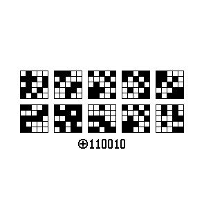

# Put ciphertext in your avatar

This little proggie `encode.pl` takes text input and a secret, and outputs a [one-time pad](https://en.wikipedia.org/wiki/One-time_pad) as a handy little picture you can use as your avatar. It can also include a hint to make it easier for the receiver. I use it to encode my direct contact in my profile photo on LinkedIn; if someone makes the effort to decode this, they are definitely worth talking to!

There is a `makefile` with an example which puts all the pieces together. (Requires Perl 5, `gnumake`, and `convert` from ImageMagick.)

```bash
$ printf "Hello\nworld" | gnumake
printf "1\n1\n0\n0\n1\n0\n" > secret.txt
mkdir -p output
./encode.pl -H hint-110010.pbm secret.txt font-5x5.txt output/example.pbm
plaintext:
Hello
world
plaintext bitmap:
*   *   ***   *      *       ***
*   *  *   *  *      *      *   *
*****  *****  *      *      *   *
*   *  *      *      *      *   *
*   *   ****   ****   ****   ***

* * *   ***   * **   *          *
* * *  *   *  **  *  *       ****
* * *  *   *  *      *      *   *
* * *  *   *  *      *      *   *
 * *    ***   *       ****   ****

ciphertext bitmap:
 *     ***    * * *  ** **  **
*** *   *        *   * * *  ** *
 *  *  *  **   *  *     *   * *
** *     **   ***     *  *     **
* *      *    **  *     **  * ***

**  *  * ***    *    * * *   * *
   **  *** *            *    * *
****     ***  ***     *  *     **
*      ** *     **   ***     *
**      * **  ** **  **  *     **

convert output/example.pbm -strip output/example.png
```
An creates this:


(`decode.pl` left as exercise to the reader...)

## DISCLAIMER!
It goes without saying, but this is a toy; it is not meant for serious encryption.
